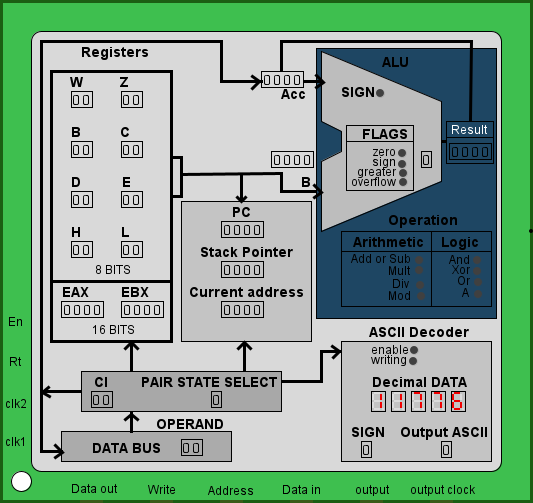

# SAGA16 a 16-bits CPU using Logisim

First, this project is part of a curricular component of my course. The project is for learning purposes and doesn't challenge itself too much to do anything other than what is written here.

For future purposes, I intend to create an assembler code interpreter in python that will transform instructions into hexadecimal blocks.

# Download Logisim

## Simulator used to build the CPU.

[Logisim Evolution](https://github.com/logisim-evolution/logisim-evolution)

# Video of the process

[Projetei a minha propria CPU no Logisim](https://youtu.be/KB68Z_t6xJ8)

## ARCHITECTURE OF THE SAGA16 CPU

An important piece of information is that the cpu has two clocks, one with 1 pulse and the other with 2 pulses, which generates this table:

|Clock 1|Clock 2|
|--|--|
|0 |0 |
|0 |1 |
|1 |0 |
|1 |1 |

The next instruction is started when the system clock 1 and 2 reaches 1 1.

SAGA16 allows reading only one instruction at a time. As soon as the instruction is read, it is already being executed, hence the lack of an instruction register. Thus, it is impossible to implement a pipelined system on the cpu.
The project contains some gaps in the instructions, which means that there is still room to increase the set of instructions on the cpu, being able to add functions of input of buttons or some keyboard, besides being able to increase the output system to an rgb screen available in logisim , but that would be hard and difficult work.

The SAGA CPU consists of the following functional
units:

- Register pairs, 8-bit registers, 16-bits registers, Accumulator.

- Arithmetic and logic unit (ALU) with flags.

- Instruction registrar and control unit section.
  
- BCD unit to ASCII output.
  
- Program counter register
### Registers:

The registers section consists of 8-bits registers and 16-bit registers:

- Program counter (PC)

- Stack pointer (SP)

- Six 8-bit general purpose registers arranged in pairs,
referred to as B,C; D,E; and H,L

- A temporary register pair called W,Z, which also loads the address to the SP

The program counter maintains the memory address of the current program instruction and is incremented automatically during every instruction fetch. The stack pointer contains an address of the location of some available stack in memory. The stack pointer can be initialized to read or write memory, it can also be used to load a character stack.

## INSTRUCTION SET

### Summary of processor instructions
Notes: This CPU allows the creation of chars and strings, which are only for visualization and determined via code.

|All registers|Register pairs| |
|-------|-------|------|
|Teemporary registers|110 - W|111 - Z|
|Main registers|000 - B|001 - C|
|Main registers|010 - D|011 - E|
|Main registers|100 - H|101 - L|
|Stack pointer registers|W&Z||
|16-bit direct storage|**Null** - F|**Null** - G|

|Meaning|Acronym|Description|
|-------|-------|-----------|
|From   |SSS|3 Bits responsible for selecting where some information will come from|
|To     |DDD    |3 Bits responsible for selecting the destination of some data|
|Memory |M|Ram memory |
|Register|r|Any register|
|Register Pair|r&r|Matches any of the 4 pairs of registers|
|Accumulator|A|Almost all manipulated data in ALU will be stored in this register and replaced by another one, as it is a temporary register|
|16 bits|WORD|All instruction with "WORD" works with 16 bits data, that means it will do a direct operation with 16 bits using whatever is in the F and G registers|
|8 bits|BYTE|All instruction with "BYTE" works with 8 bits data, that means it will do a direct operation with 8 bits|


| Mnemonic | Description |HexCode| D <sub>7</sub> | D <sub>6</sub> | D <sub>5</sub> | D <sub>4</sub> | D <sub>3</sub> | D <sub>2</sub> | D <sub>1</sub> | D <sub>0</sub> |
|----------|-------------|----|---|---|---|---|---|---|---|---|
|NOP| No operation |00| 0 | 0 | 0 | 0 | 0 | 0 | 0 | 0 |
|MOV **<sub>r1, r2</sub>** | <sub>r2</sub> is copied to <sub>r1</sub> |--| 0 | 1 | D | D | D | S | S | S |
|MOV M, **<sub>r</sub>**| The value of <sub>r</sub> is written to M (memory) |7-| 0 | 1 | 1 | 1 | 0 | S | S | S |
|MOV **<sub>r</sub>**, M | The value read from M is copied to <sub>r</sub> |--| 0 | 1 | D | D | D | 1 | 1 | 0 |
|MVI **<sub>r</sub>** | The value read from r is copied to Accumulator |7-| 0 | 1 | 1 | 1 | 1 | S | S | S |
|MVI M | The value read from Memory is copied to Accumulator |7e| 0 | 1 | 1 | 1 | 1 | 1 | 1 | 0 |
|MOV **<sub>r</sub>**, A| The value of Accumulator is copied to <sub>r</sub> |0-| 0 | 0 | 0 | 0 | 1 | D | D | D |
|MOV **M**, A| The value of **M** is copied to Accumulator |0e| 0 | 0 | 0 | 0 | 1 | 1 | 1 | 0 |
|LXI **B**| Load imediate from memory (only 1 byte at a time) register pair **B & C** |06| 0 | 0 | 0 | 0 | 0 | 1 | 1 | 0 |
|LXI **D**| Load imediate from memory (only 1 byte at a time) register pair **D & E** |16| 0 | 0 | 0 | 1 | 0 | 1 | 1 | 0 |
|LXI **H**| Load imediate from memory (only 1 byte at a time) register pair **H & L** |26| 0 | 0 | 1 | 0 | 0 | 1 | 1 | 0 |
|LXI **W** | Load imediate from memory (only 1 byte at a time) temporary register pair **W & Z** |36| 0 | 0 | 1 | 1 | 0 | 1 | 1 | 0 |
|LOAD PAIR at F| Load data from register pair temporary to F register |18+| 0 | 0 | 0 | 1 | 1 | 0 | 0 | 0 |
|LOAD PAIR at G| Load data from register pair temporary to G register |1d+| 0 | 0 | 0 | 1 | 1 | 1 | 0 | 1 |
|ADD BYTE r| Add A plus register |8-| 1 | 0 | 0 | 0 | 0 | S | S | S |
|MULT BYTE r| Multiplies A with register |8-| 1 | 0 | 0 | 0 | 1 | S | S | S |
|OPA BYTE| Returns A ignoring B. It can be used to generate flags, without performing an arithmetic operation |9-| 1 | 0 | 0 | 1 | 0 | S | S | S |
|DIV BYTE r| Divide A with register|9-| 1 | 0 | 0 | 1 | 1 | S | S | S |
|ANA BYTE r| And operation A with register |a-| 1 | 0 | 1 | 0 | 0 | S | S | S |
|XRA BYTE r| Xor operation A with register |a-| 1 | 0 | 1 | 0 | 1 | S | S | S |
|ORA BYTE r| Or operation A with register |b-| 1 | 0 | 1 | 1 | 0 | S | S | S |
|MOD BYTE r| Gives the remainder of dividing ACC with register |b-| 1 | 0 | 1 | 1 | 1 | S | S | S |
|ADD WORD| Add F <sub>(16)</sub> plus G <sub>(16)</sub> |28+| 0 | 0 | 1 | 0 | 1 | 0 | 0 | 0 |
|MULT WORD| Multiplies F <sub>(16)</sub> by G <sub>(16)</sub> |29| 0 | 0 | 1 | 0 | 1 | 0 | 0 | 1 |
|OPA WORD| Returns A ignoring B. It can be used to generate flags, without performing an arithmetic operation |2a| 0 | 0 | 1 | 0 | 1 | 0 | 1 | 0 |
|DIV WORD| Divide F <sub>(16)</sub> by G <sub>(16)</sub> |2b| 0 | 0 | 1 | 0 | 1 | 0 | 1 | 1 |
|ANA WORD| And operation with F <sub>(16)</sub> and G <sub>(16)</sub> |2c| 0 | 0 | 1 | 0 | 1 | 1 | 0 | 0 |
|XRA WORD| Xor operation with F <sub>(16)</sub> and G <sub>(16)</sub> |2d| 0 | 0 | 1 | 0 | 1 | 1 | 0 | 1 |
|ORA WORD| Or operation with F <sub>(16)</sub> and G <sub>(16)</sub> |2e| 0 | 0 | 1 | 0 | 1 | 1 | 1 | 0 |
|MOD WORD| Gives the remainder of dividing F <sub>(16)</sub> and G <sub>(16)</sub>|2f| 0 | 0 | 1 | 0 | 1 | 1 | 1 | 1 |
|STW F| Store 16 bits F register direct on memory |3e| 0 | 0 | 1 | 1 | 1 | 1 | 1 | 0 |
|JMP | Jump unconditional |c3| 1 | 1 | 0 | 0 | 0 | 0 | 1 | 1 |
|JZ | Jump on zero |c0| 1 | 1 | 0 | 0 | 0 | 0 | 0 | 0 |
|JNZ | Jump if not zero |c8| 1 | 1 | 0 | 0 | 1 | 0 | 0 | 0 |
|JM | Jump on minus |d0| 1 | 1 | 0 | 1 | 0 | 0 | 0 | 0 |
|JP | Jump on positive |d8| 1 | 1 | 0 | 1 | 1 | 0 | 0 | 0 |
|JG | Jump on greater, if A > B |e0| 1 | 1 | 1 | 0 | 0 | 0 | 0 | 0 |
|JL | Jump on less, if A < B |e8| 1 | 1 | 1 | 0 | 1 | 0 | 0 | 0 |
|JC | Jump on carry |f0| 1 | 1 | 1 | 1 | 0 | 0 | 0 | 0 |
|JNC | Jump on not carry |f8| 1 | 1 | 1 | 1 | 1 | 0 | 0 | 0 |
|LDW var | Load value from memory block to HL register pair |c1| 1 | 1 | 0 | 0 | 0 | 0 | 0 | 1 |
|OUT | Print number or char elements |02+| 0 | 0 | 0 | 0 | 0 | 0 | 1 | 0 |

# How does instructions works?

In the instruction set above, some instructions have a hexadecimal number with a + sign.

I'll explain so you don't have any doubts.

Instructions like **OUT**, I thought I could write them like this:

- out -%d - To print signed numbers.
- out %d - To print unsigned numbers.
- out %s string - Print characters.

In hexadecimal the instructions would be: 

- 02 + 13 => 0213 - out ("-%d", number)
- 02 + 03 => 0203 - out ("%d", number)
- 02 + 00 => 0200 - out ("%s", string)

**Obs: Remember that I'm not adding, just concatenating**

That is, 02 is the output instruction, and the rest are instruction complements.

Let's see another example that happens:

**Load pair** These follow instructions loads at register F or register G any 16-bits value:

**Load pair at f**, can be written in the following ways.

### The 2 least significant bits of this instruction says which pair to load

- 1800 -> Loads the pair BC.
- 1801 -> Loads the DE pair.
- 1802 -> Loads of HL pair.
- 1803 -> Loads of the WZ pair.

**Load pair at G**, can be written in the following ways.

### The 2 least significant bits of this instruction says which pair to load

- 1d00 -> Loads the BC pair.
- 1d01 -> Loads the DE pair.
- 1d02 -> Loads the HL pair.
- 1d03 -> Loads the WZ pair.

**Add** Instruction:

### The 2 least significant bits of this instruction says if is addition or subtraction

- 2800 -> Addition x+y
- 2801 -> Addition x+(-y)

# Images

## How is the cpu seen from a further angle?

You can see that the cpu communicates with the ram memory and with a terminal, it doesn't have an input system that is present in that circuit, not yet.


Logisim allows you to customize the appearance of your integrated circuits. This is the final appearance of my cpu in the simulator.



## Registers of: SAGA16

This is the cpu main registers scheme.


## How strings works?

Word storage consists of two characters in 1 block of memory, if there is a row of blocks containing characters, we will have a string, and who will mark the end of this string is 0x0000.


# Fibonacci algorithm

```
3600 3638 0200 0600 0601 5000 5900 1801
1d02 3600 362c 0200 3600 3634 3e00 0203
2800 6200 6b00 5000 5900 3600 3607 c300
0000 0000 0000 0000 0000 0000 0000 0000
0000 0000 0000 0000 0000 0000 0000 0000
0000 0000 0000 0000 0a00 0000 0000 0000
0000 0000 0000 0000 0001 0000 0000 0000
4669 626f 6e61 6363 6900 0000 0000 0000
```


SAGA16 allows me to run an algorithm that calculates and prints the fibonacci sequence in the terminal.

I'll try to explain the hex code above in the space bellow.

## Code explanation

<p style="color: yellow">3600 3638 Loads the stack address where the word "Fibonacci" is</p>
<p style="color: #40E0D0">0200 Prints characters to which the stack address is pointing</p>
<p style="color: #FFC0CB">0600 0601 Loads 1 at BC pair</p>
<p style="color: #FFA500">5000 MOV D, B
                      <br/>5900 MOV E, C</p>
<p style="color: #FFFFFF">1801 Gets the value of the DE pair to load into F
                      <br/>1d02 Gets the value of the HL pair to load into G</p>
<p style="color: yellow">3600 362c Loads the stack address where the word "\n" is</p>
<p style="color: #40E0D0">0200 Prints characters to which the stack address is pointing</p>
<p style="color: yellow">3600 3634 Loads the stack address where i'll store fibonacci number</p>
<p style="color: #00BFFF">3e00 Store fibonacci number</p>
<p style="color: #40E0D0">0203 Prints the stored fibonacci number</p>
<p style="color: #00FF00">2800 Add F+G. The result is stored in the BC pair automatically</p>
<p style="color: #FFA500">6200 MOV H, D
                      <br/>6b00 MOV L, E</p>
<p style="color: #FFA500">5000 MOV D, B
                      <br/>5900 MOV E, C</p>
<p style="color: yellow">3600 3607 Loads the stack address where loop starts</p>
<p style="color: #9370DB">c300 Jump unconditionally to the stored address</p>
<p style="color: #A52A2A">0a00 "\n"<br/>4669 626f 6e61 6363 6900 0000 "Fibonacci"</p>


**Observation:** This form of language was defined by me and has nothing to do with any language nor does it try to imitate any known language. I think you can understand what this "programming" means.


# Char table


|ASCII Character|Hexadecimal|Binary|
|-----------|--|------------|
|NUL	    |00|	00000000|
|SOH	    |01|	00000001|
|STX	    |02|	00000010|
|ETX	    |03|	00000011|
|EOT	    |04|	00000100|
|ENQ	    |05|	00000101|
|ACK	    |06|	00000110|
|BEL	    |07|	00000111|
|BS	        |08|	00001000|
|HT	        |09|	00001001|
|LF	        |0A|	00001010|
|VT	        |0B|	00001011|
|FF	        |0C|	00001100|
|CR	        |0D|	00001101|
|SO	        |0E|	00001110|
|SI	        |0F|	00001111|
|DLE	    |10|	00010000|
|DC1	    |11|	00010001|
|DC2	    |12|	00010010|
|DC3	    |13|	00010011|
|DC4	    |14|	00010100|
|NAK	    |15|	00010101|
|SYN	    |16|	00010110|
|ETB	    |17|	00010111|
|CAN	    |18|	00011000|
|EM	    |19|	00011001|
|SUB	|1A|	00011010|
|ESC	|1B|	00011011|
|FS	    |1C|	00011100|
|GS	    |1D|	00011101|
|RS	    |1E|	00011110|
|US	    |1F|	00011111|
|Space	|20|	00100000|
|!	    |21|	00100001|
|"	    |22|	00100010|
|#	    |23|	00100011|
|$	    |24|	00100100|
|%	    |25|	00100101|
|&	    |26|	00100110|
|'	    |27|	00100111|
|(	    |28|	00101000|
|)	    |29|	00101001|
|*	    |2A|	00101010|
|+	    |2B|	00101011|
|,	    |2C|	00101100|
|-	    |2D|	00101101|
|.	    |2E|	00101110|
|/	    |2F|	00101111|
|0	    |30|	00110000|
|1	    |31|	00110001|
|2	    |32|	00110010|
|3	    |33|	00110011|
|4	    |34|	00110100|
|5	    |35|	00110101|
|6	    |36|	00110110|
|7	    |37|	00110111|
|8	    |38|	00111000|
|9	    |39|	00111001|
|:	    |3A|	00111010|
|;	    |3B|	00111011|
|<	    |3C|	00111100|
|=	    |3D|	00111101|
|>	    |3E|	00111110|
|?	    |3F|	00111111|
|@	    |40|	01000000|
|A	    |41|	01000001|
|B	    |42|	01000010|
|C	    |43|	01000011|
|D	    |44|	01000100|
|E	    |45|	01000101|
|F	    |46|	01000110|
|G	    |47|	01000111|
|H	    |48|	01001000|
|I	    |49|	01001001|
|J	    |4A|	01001010|
|K	    |4B|	01001011|
|L	    |4C|	01001100|
|M	    |4D|	01001101|
|N	    |4E|	01001110|
|O	    |4F|	01001111|
|P	    |50|	01010000|
|Q	    |51|	01010001|
|R	    |52|	01010010|
|S	    |53|	01010011|
|T	    |54|	01010100|
|U	    |55|	01010101|
|V	    |56|	01010110|
|W	    |57|	01010111|
|X	    |58|	01011000|
|Y	    |59|	01011001|
|Z	    |5A|	01011010|
|[	    |5B|	01011011|
|\	    |5C|	01011100|
|]	    |5D|	01011101|
|^	    |5E|	01011110|
|_	    |5F|	01011111|
|`	    |60|	01100000|
|a	    |61|	01100001|
|b	    |62|	01100010|
|c	    |63|	01100011|
|d	    |64|	01100100|
|e	    |65|	01100101|
|f	    |66|	01100110|
|g	    |67|	01100111|
|h	    |68|	01101000|
|i	    |69|	01101001|
|j	    |6A|	01101010|
|k	    |6B|	01101011|
|l	    |6C|	01101100|
|m	    |6D|	01101101|
|n	    |6E|	01101110|
|o	    |6F|	01101111|
|p	    |70|	01110000|
|q	    |71|	01110001|
|r	    |72|	01110010|
|s	    |73|	01110011|
|t	    |74|	01110100|
|u	    |75|	01110101|
|v	    |76|	01110110|
|w	    |77|	01110111|
|x	    |78|	01111000|
|y	    |79|	01111001|
|z	    |7A|	01111010|
|{	    |7B|	01111011|
|Barra	|7C|	01111100|
|}	    |7D|	01111101|
|~	    |7E|	01111110|
|DEL	|7F|	01111111|